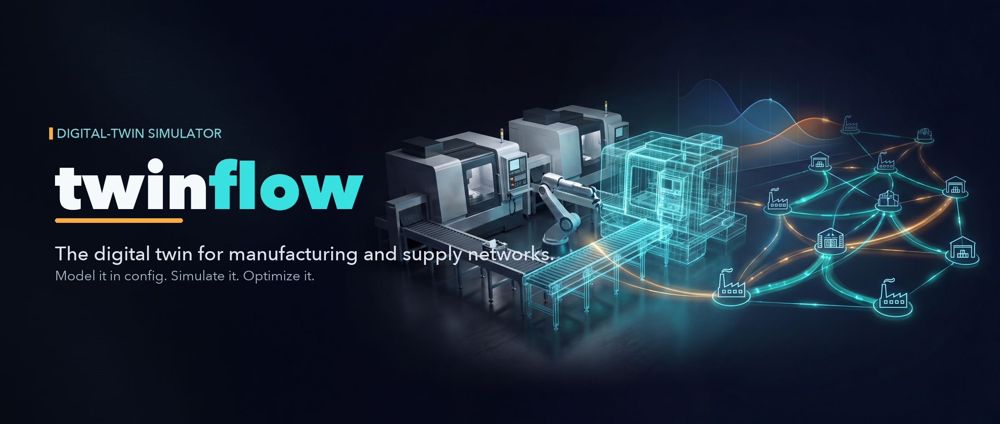

<div align="center">



### A working software copy of your operation that you can run experiments on.

**Describe your factory floor in a spreadsheet and a config file. Get back honest answers about dates, bottlenecks, and staffing - each with a confidence range, not a guess.**

[](#status--quality)
[](#status--quality)
[](#status--quality)
[](#status--quality)
[](#roadmap)
[](#license)

**[Quick start](#-quick-start)  ·  [How it works](#-how-it-works)  ·  [For AI agents](#-for-ai-agents-and-multi-agent-systems)  ·  [Roadmap](#roadmap)**

</div>

---

## The problem

Most plants promise dates and set staffing from a spreadsheet and years of gut feel. That works until it doesn't: a rush order, a new product mix, a machine down, a temp short. A spreadsheet cannot tell you what happens next, and it never tells you how sure it is.

`twinflow` builds a **digital twin** of your operation - a working software copy you can run experiments on. Because real floors are random (cycle times vary, scrap happens), it simulates each scenario many times and reports a **confidence interval**, a low-to-high range you can trust, instead of a single number pretending to be certain.

> You stop quoting dates you can't hit, and stop adding capacity you don't need.

No custom code per plant. **One `model.yaml` plus a production plan (`.xlsx` or `.csv`) is a complete client.**

---

## What you're stuck on → what twinflow gives you

| The question you're stuck on | What `twinflow` hands back |
|---|---|
| Will these orders ship on time? | Completion dates and on-time %, each with a confidence range |
| Where does the line actually choke? | Utilization per cell and per machine, and a clear wait breakdown: starved vs blocked vs waiting-on-material |
| Is one more operator worth it? | A paired what-if that reports a confidence interval on the *difference*, not two ranges that hide the signal |
| How big should the batch or buffer be? | Every option on a lever grid, side by side, fairly compared |
| Can I trust last quarter's number? | A reproducibility stamp on every run: same inputs, same answer, forever |

---

## 🔧 How it works

Four steps, start to finish.

**1. Define the floor** in `model.yaml` - in plain floor language, never code:

```yaml
part_types:
  - { name: wire,  uom: ft }
  - { name: blank, uom: piece }
  - { name: carton, uom: piece }

stocks:
  - { name: wire_stock, thing: wire, uom: ft }

locations:
  - name: cut
    consumes: [{ thing: wire, qty: 10, uom: ft }]
    emits:    [{ thing: blank, uom: piece }]                  # count derived from the recipe
    scrap:    { rate: 0.05, thing: scrap_blank, uom: piece }  # 5% scrap, split automatically
    batch_size: "200 piece"
    time_model: { kind: rate_based, rate: 2.0 }
    machine: cut_01
    labor_skill: operator

  - name: pack
    consumes: [{ thing: blank, qty: 1, uom: piece }]
    emits:    [{ thing: carton, qty: 1, uom: piece }]
    time_model: { kind: rate_based, rate: 5.0 }
    machine: pack_01
    labor_skill: operator

labor:
  pools:
    - { name: line_labor, skills: [operator], headcount: 2 }

routing:
  - { part: carton, steps: [cut, pack] }
```

**2. Provide the plan** as a spreadsheet or CSV (`plan.csv`):

| work_order_id | part   | qty | start_date | due_date |
|---------------|--------|-----|------------|----------|
| WO-1001       | carton | 500 | 0          | 3600     |
| WO-1002       | carton | 250 | 600        | 5400     |

**3. Validate, then simulate.** **4. Read the report.**

You declare *what the floor does* - "5% scrap", "batches of 200", "cut then pack". The engine turns that into the mechanism. You never write a simulation by hand.

---

## 🚀 Quick start

Install from source:

```bash
python -m venv .venv && . .venv/bin/activate
pip install -e ".[dev]"
```

Run it from the command line:

```bash
twinflow validate model.yaml                                     # check the floor before running
twinflow run model.yaml --plan plan.csv --reps 30                # simulate 30 replications
twinflow balance model.yaml --plan plan.csv --sweep sweep.json --reps 30   # sweep the levers
twinflow report <run-id> --out html                              # render the emailable report
```

> `--sweep` takes a small **JSON** file: `{"labor.pools[0].headcount": [2, 3, 4]}`.

Or drive it from Python - the same operations, callable in your own code:

```python
from twinflow.model import load_model
from twinflow.plan import load_plan
from twinflow.plan.replication import ReplicationRunner

model = load_model("model.yaml")               # parse + validate + compile, once
plan  = load_plan("plan.csv", model.registry)
results = ReplicationRunner("model.yaml").run(plan, reps=30, base_seed=42)
```

---

## ✅ What you get today

Everything here is **built and tested** (326 passing tests). The library API is stable; the `twinflow` command surfaces the same operations.

| Capability | What it means for you |
|---|---|
| **Model any discrete floor from config** | Stocks, work centers, machines, labor pools, routings, scrap, rework, batching, and setup/changeover - all declared, never coded. One contract covers cutting, pouring, assembly, sorting, and yield loss. |
| **Plan from Excel or CSV** | Your production plan drives order releases and any work already on the floor. Hand over the spreadsheet you already keep. |
| **Reproducible, seeded runs** | Every run is repeatable to the number. Same inputs, same answer - which is what makes fair comparison possible. |
| **KPIs from one event log** | Completion dates and on-time %, per-cell and per-machine utilization, a clear wait breakdown (starved / blocked / waiting-on-material), labor and machine hours, setup hours separate from run hours, and work-in-progress over time. |
| **What-if lever sweeps** | Try staffing, buffers, and batch sizes across a grid and see every option side by side, fairly paired with common random numbers. The twin shows the trade space and deliberately picks **no winner** - the call stays yours. |
| **Replications + confidence intervals** | Run many replications in parallel. Compare two setups and get a confidence interval on the *difference*, not two overlapping ranges. |
| **One emailable report** | A single self-contained HTML file that opens offline with no internet, plus a versioned JSON file for machines. Every report opens with the assumptions the engine had to make, stated plainly. |
| **Full reproducibility stamp** | Each run records hashes of the model and plan, the seed, the engine version, the Python version, and the exact dependency set. A result can always be traced back and re-created. |

---

## 🤖 For AI agents and multi-agent systems

`twinflow` is built to be driven by software, not just by a person clicking. It is a **safe sandbox** where an agentic system can try a decision a thousand times before it ever touches a real worker, planner, or schedule.

- **Deterministic, seeded runs** - every candidate is scored on the same random draws, so comparisons are fair, not noise.
- **In-process run entry point** - callable thousands of times against an already-loaded model, no subprocess or re-parse required.
- **Structured JSON output** - a versioned KPI sidecar an agent can read back without re-simulating.
- **No network, no secrets** - a pure, self-contained sandbox.

> The pattern: **agents propose changes, the twin scores them, and your planners, schedulers, and operators get the recommendation** - with a confidence range attached.

Available today: programmatic runs, sweeps, replications, and the JSON KPI contract. The richer agent-interaction surface (a standard tool interface, live scoring loops) is evolving - see the roadmap.

---

## 🧭 Planned

> These are direction, not shipped. They extend the same one-contract engine rather than replacing it.

<details open>
<summary><b>Supply-chain twin</b></summary>

Extend beyond the floor to orders, sub-vendors, and multi-echelon inventory. Same engine, new node types. A connector to a system of record becomes a column mapping onto the existing plan contract, not a rewrite.
</details>

<details>
<summary><b>Reinforcement learning via Gymnasium</b></summary>

Expose the twin as a Gymnasium environment so RL methods can learn staffing, dispatch, and inventory policies against a fast, faithful simulator.
</details>

<details>
<summary><b>Forecaster integrations</b></summary>

Plug in demand and lead-time forecasters (for example Prophet) to feed plans and generate scenarios automatically.
</details>

<details>
<summary><b>Optimizers</b></summary>

Pair the sweep and scoring surface with optimizers to *search* for the best way forward, instead of only enumerating a grid.
</details>

<details>
<summary><b>Live ERP / MES connectors</b></summary>

Plans arriving straight from systems of record instead of spreadsheets.
</details>

---

## 🏗️ Architecture

A five-layer design. Lower layers never import higher ones. Layers 0 through 2 never change per client - only config does.

| Layer | Package | Owns |
|---|---|---|
| 0 · Engine | `twinflow.engine` | SimPy clock, deadlock-safe acquisition, per-source random streams |
| 1 · Primitives | `twinflow.primitives` | Bundle, Stock, Location, Machine, Transform, TimeModel, LaborPool |
| 2 · Model | `twinflow.model` | `model.yaml` → validated routing graph + BOM; the only YAML and expression trust boundary |
| 3 · Plan | `twinflow.plan` | Work orders, release timing, initial WIP, the run driver, replications |
| 4 · Instrumentation / Report | `twinflow.instrumentation`, `twinflow.report` | Event log → KPIs → sweeps; self-contained HTML + JSON report |

**The core rule:** a new client is data, never code. A capability a floor needs is added to the engine for everyone, never subclassed per client.

Deep docs: the product/design/plan specs live in [`.claude/specs/factory-twin-scaffold/`](.claude/specs/factory-twin-scaffold/) and the stable project context in [`.claude/steering/`](.claude/steering/).

---

## Status & quality

- **Python** ≥ 3.11.
- **326 tests** across unit, analytical, and integration layers.
- **Blocking CI gates:** `ruff`, `mypy --strict`, `pytest`, `pip-audit` - the build fails on any finding.
- **Config is the only trust boundary:** YAML is loaded through one safe door, expressions run in one sandbox, and validation reports every problem before a run starts.
- **Reproducible by construction:** every run carries a stamp that lets you re-create it exactly.

> Status: **alpha.** The single-floor engine is complete and tested; the roadmap items below are in progress.

---

## Roadmap

**v1 - available now (built and tested)**
- Single-floor digital twin from pure config
- Excel/CSV plans, initial WIP, terminating stochastic runs
- KPI suite, what-if lever sweeps, parallel replications with confidence intervals
- Self-contained HTML report + versioned JSON sidecar
- `twinflow` CLI: `validate`, `run`, `balance`, `report`

**Near-term**
- Supply-chain nodes: orders, sub-vendors, multi-echelon inventory
- Gymnasium environment for reinforcement learning
- Forecaster hooks (e.g. Prophet) feeding plans and scenarios
- Optimizer loop over the scoring surface

**Later**
- Live ERP / MES connectors
- Richer multi-agent orchestration and a standard agent tool interface
- Calibration against real historical production runs

> Everything under **v1** is real and running today. Everything below it is direction.

---

## License

Proprietary. © Joshua Schultz. All rights reserved.
