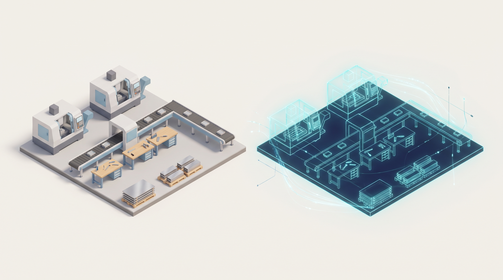
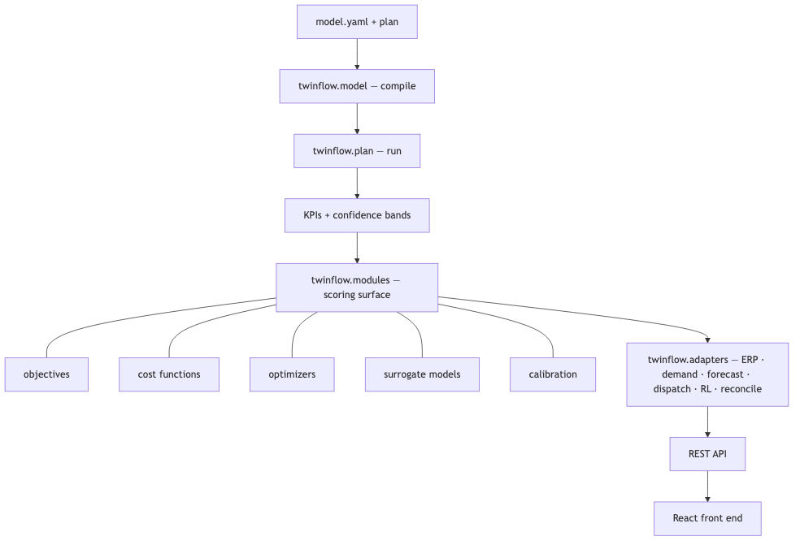

# twinflow documentation

The complete manual. Whether you have never opened twinflow or you are looking up one
config field, start here.

Product direction: [Enterprise roadmap](enterprise-roadmap.md) and its linked
[implementation playbook](enterprise-build-playbook.md) describe the proposed path to
agent-driven manufacturing, front-office, and complex supply-chain decision twins.

## New here? Follow this path

1. [concepts.md](concepts.md) — what a digital twin is here, the vocabulary, and why
   every answer comes with a confidence range. **Read this first.**
2. [install.md](install.md) — install the engine, the API, and the front end.
3. [quickstart.md](quickstart.md) — from nothing to a running twin in five minutes.
4. [modeling.md](modeling.md) — describe your own floor in `model.yaml`.
5. [running.md](running.md) — run it and read the results.
6. [optimizing.md](optimizing.md) — stop reporting, start deciding.

## Full reference (look anything up)

**Model & data**
| Doc | Covers |
|---|---|
| [concepts.md](concepts.md) | Mental model, vocabulary, uncertainty, reproducibility |
| [modeling.md](modeling.md) | The complete `model.yaml` reference — every section and field |
| [data.md](data.md) | Every data contract in and out: plan, event log, inventory, KPI/JSON artifacts |
| [supply-chain.md](supply-chain.md) | Stocks, reorder points, lead time, multi-echelon, inventory KPIs |
| [active-control.md](active-control.md) | Dispatch rules, order release, disruptions (breakdown/absence/rush) |
| [glossary.md](glossary.md) | Every term, defined |

**Using it**
| Doc | Covers |
|---|---|
| [quickstart.md](quickstart.md) | End to end in five minutes |
| [running.md](running.md) | Running the twin, replications, reading the report and every KPI |
| [optimizing.md](optimizing.md) | Sweeps, objectives, costs, optimizers, ML surrogates, inventory optimization |
| [tuning.md](tuning.md) | Variation, calibration against real history, sensitivity, guardrails |
| [cli.md](cli.md) | Every `twinflow` command and flag |
| [frontend.md](frontend.md) | The web UI: every tab and what you do in it |
| [troubleshooting.md](troubleshooting.md) | Problems, causes, fixes |

**Extending & integrating**
| Doc | Covers |
|---|---|
| [modules.md](modules.md) | The module surface: objectives, costs, optimizers, models — and how to add your own |
| [adapters.md](adapters.md) | Integration surfaces: ERP/MES connectors, demand, forecasting, dispatch, RL, plan-vs-actual |
| [api.md](api.md) | The local REST API — endpoints and job polling |
| [architecture.md](architecture.md) | The five-layer design, for developers |

## The shape of the system

The one rule the whole system rests on: **a new client is data, never code.** You never
write a simulation by hand — you declare what the floor does, and the engine builds the
mechanism.

## Three ways to drive it

- **The `twinflow` command** — `validate`, `run`, `balance`, `report`, `optimize`,
  `serve`. See [cli.md](cli.md).
- **The Python library** — the same operations, callable in your own code. See
  [running.md](running.md) and [optimizing.md](optimizing.md).
- **The web UI** — map the floor and run / sweep / optimize in the browser. See
  [frontend.md](frontend.md).
