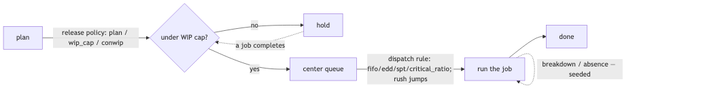

# Active control

By default a twinflow floor runs **passive rules**: each work center takes its queue in
arrival order, and every order is released on its plan date. Active control lets the twin
*make decisions* instead: sequence the queue by a rule, hold work back to cap WIP, and
survive disruptions like a machine going down. It turns the twin from a "what if" viewer
into a "what to do" tool.

Every setting here is ordinary config the compiler turns into engine mechanism, and every
one is a lever a [sweep or optimizer](optimizing.md) can search. Worked example:
[`examples/active-control/`](../examples/active-control/).

> New to twinflow? Read [concepts](concepts.md) and [modeling](modeling.md) first.

The three control points a job passes through:



Release decides *when* work enters, dispatch decides *what runs next*, and disruptions
are what the schedule has to survive.

---

## 1. Dispatch — which queued job a center runs next

Add a `dispatch:` field to a work center. When more than one job is waiting, the center
runs them in the order the rule chooses instead of first-come-first-served.

```yaml
locations:
  - name: press
    dispatch: edd          # fifo (default) | edd | spt | critical_ratio
    ...
```

| Policy | Runs next | Use it to |
|---|---|---|
| `fifo` | the job that arrived first (the default) | keep it simple; nothing changes |
| `edd` | the job with the earliest due date | protect on-time delivery |
| `spt` | the job with the shortest processing time | clear the queue fast, raise throughput |
| `critical_ratio` | the job with the least slack per unit of work | balance urgency against size |

- `fifo` is the default, so a model with no `dispatch` field behaves exactly as before.
- The rule matters most at the **bottleneck** — the slow center where the queue builds.
- These four mirror the `DispatchPolicy` names in [adapters](adapters.md); here they are
  wired into the engine itself.

### Compare policies (dispatch is a lever)

`dispatch` is a config value, so you can sweep it and compare on-time % side by side. Put
the candidates in a sweep JSON and run [`balance`](cli.md):

```json
{ "locations[press].dispatch": ["fifo", "edd", "spt", "critical_ratio"] }
```

```bash
twinflow balance examples/active-control/model.yaml --plan examples/active-control/plan.csv \
  --sweep sweep.json --reps 30
```

> Note: `twinflow optimize --lever` ranges over integer knobs (staffing, capacity), not
> categorical ones like a policy name, so use a `balance` sweep to compare dispatch rules.

---

## 2. Order release — how work enters the floor

By default every order is released on its `start_date`. That can flood the floor. A
release policy holds work in a backlog and lets it on only when the floor has room —
CONWIP-style flow control a planner actually uses.

```yaml
release:
  policy: wip_cap        # plan (default) | wip_cap | conwip
  wip_cap: 5
```

| Policy | Behavior |
|---|---|
| `plan` | release each order on its `start_date` (the default) |
| `wip_cap` / `conwip` | hold new releases while `wip_cap` orders are already in the system; admit the next as one finishes |

A WIP cap trades a little throughput for much steadier flow, shorter queues, and dates you
can defend. Try a few caps with a sweep (`{"release.wip_cap": [3, 5, 8]}`) and watch the
on-time band and WIP move.

---

## 3. Disruptions — plan for a bad day

A schedule that assumes everything goes right is the one a plant manager distrusts. These
add real, **seeded** disruptions so your dates survive a machine failure or a short crew.
Each draws from its own random stream, so a run still reproduces to the number.

### Machine breakdown

```yaml
locations:
  - name: press
    breakdown:
      mtbf: "20m"                                   # mean time between failures
      mttr: {dist: lognormal, mean: "5m", cv: 0.4}  # repair-time distribution
```

- `mtbf` (mean time between failures) and the `mttr` (mean time to repair) accept a
  **duration string** — `"20m"`, `"5m"`, `"40h"`, `"90s"` — or a plain number of seconds.
- `mttr` is a distribution (`dist` + `mean` + `cv`), so repair times vary like real ones.
- The machine fails on a seeded schedule and is unavailable for the drawn repair time.
- **Alpha limitation, stated plainly:** breakdowns are *non-preemptive* — a failure seizes
  the machine at the next job boundary and delays what follows, rather than interrupting a
  job mid-cut.
- Downtime is reported per machine in the run metadata
  (`run_meta["downtime_seconds_by_machine"]`).

### Operator absence

```yaml
labor:
  pools:
    - {name: floor, headcount: 4, skills: [op], absence_rate: 0.1}
```

- `absence_rate` is the chance each headcount slot is unavailable for a run.
- A seeded draw reduces the pool's effective headcount, **floored at 1** so a pool never
  empties and deadlocks.
- **Alpha limitation:** absence is decided per run, not per shift.

### Rush orders

Add a `priority` column to your [plan](data.md). A higher number jumps every center's
queue ahead of normal work (normal orders use `0`).

```csv
work_order_id,part,qty,start_date,due_date,priority
wo-11,part,4,600,1300,0
wo-12,part,2,700,450,5
```

Here `wo-12` is a hot order: it goes first at every work center it reaches, under any
dispatch rule.

### Reproducibility

Each disruption has its own seeded RNG stream (`SOURCE_BREAKDOWN`, `SOURCE_ABSENCE`), so
two runs with the same seed give the same failures and the same answer, and two scenarios
compare on the same bad luck (common random numbers). See [tuning](tuning.md) for why this
matters.

---

## Worked example

[`examples/active-control/`](../examples/active-control/) composes all four at once: the
press runs its queue by earliest due date, a WIP cap of 5 holds work back, the press fails
on a seeded schedule, and one plan row is a rush order.

```bash
twinflow validate examples/active-control/model.yaml
twinflow run examples/active-control/model.yaml --plan examples/active-control/plan.csv --reps 20
```

Because `--reps` is greater than 1, every KPI comes back as a mean with a low-to-high
[confidence band](concepts.md).

---

## What is not here yet (honest list)

- **Resource/labor assignment policy** (choosing *which* machine or operator, by skill or
  load) — deferred; today acquisition is machine-then-operator in a fixed order.
- **Mid-run decide-act loop** (a policy or agent choosing the next action *during* a run) —
  deferred; control is set at config time for now. The [RL environment](adapters.md) is the
  seam this will plug into.
- **Downtime as a confidence band** — breakdown downtime is in `run_meta` today, not yet a
  rendered KPI with a low-to-high range like the others.

See also: [modeling](modeling.md) · [optimizing](optimizing.md) · [supply-chain](supply-chain.md) · [troubleshooting](troubleshooting.md).
