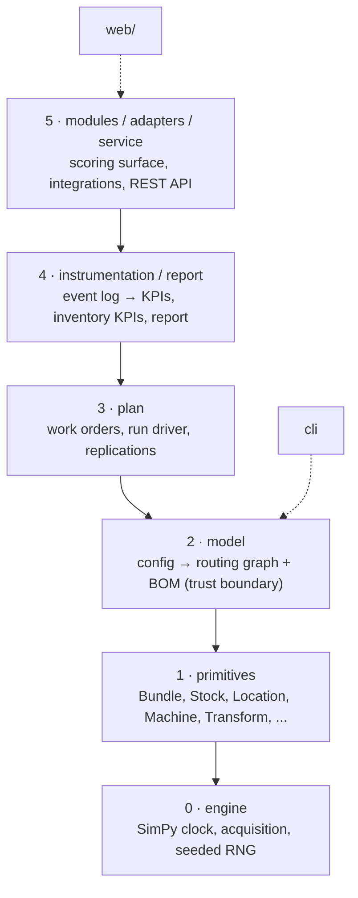

# Architecture

For developers extending twinflow. If you only want to *use* it, you never need this
page — config is the whole interface. This explains how the engine is built and the
rules that keep it small and correct.

## The core rule

> A new client is **data, never code.**

Layers 0 through 2 never change per client — only config does. A capability a floor needs
is added to the engine for everyone (compiled from config), never subclassed per client.
This is the single idea the whole design protects.

## Five layers

Lower layers never import higher ones. Each layer has one job.

| Layer | Package | Owns |
|---|---|---|
| 0 · Engine | `twinflow.engine` | SimPy clock, deadlock-safe machine-then-operator acquisition, per-source seeded RNG streams |
| 1 · Primitives | `twinflow.primitives` | `Bundle`, `Stock`, `Location`, `Machine`, `Transform`, `TimeModel`, `LaborPool`, `SetupPolicy`, `PullRule` — pure, domain-agnostic |
| 2 · Model | `twinflow.model` | `model.yaml` → validated routing graph + BOM. The only YAML and expression trust boundary |
| 3 · Plan | `twinflow.plan` | Work orders, release timing, initial WIP, the run driver, parallel replications |
| 4 · Instrumentation / Report | `twinflow.instrumentation`, `twinflow.report` | Event log → KPIs → sweeps; inventory KPIs; the self-contained HTML + JSON report |
| 5 · Modules / Adapters / Service | `twinflow.modules`, `twinflow.adapters`, `twinflow.service` | Scoring surface (objectives, costs, optimizers, models, calibration); integration surfaces; the REST API |

The CLI (`twinflow.cli`) is a thin argument parser over layers 2–5. The React front end
(`web/`) talks only to the Layer-5 REST service.

Every arrow points *down*. A lower layer never imports a higher one — that single rule is
what keeps the core small and swappable.

## The compiler is the one growth point

`twinflow.model.compile.LocationCompiler` is where new config sugar is added, and the
**only** place. It turns plain-language config (a `scrap` rate, a `quality_gate`, a
`dispatch` rule, a `breakdown`) into pure primitives. The primitives never learn what a
scrap rate or a changeover is — they only see an already-compiled `Transform`,
`SetupPolicy`, `TimeModel`, etc. (decision D-044). So a new capability is a new branch in
the compiler plus, if needed, a new pure primitive — never a per-client vertical.

The module and adapter surfaces (Layer 5) apply the same idea one level up: a new
objective, cost, optimizer, model, connector, forecaster, or dispatch policy is a
`register(name, factory)` call into a registry, never an edit to the core.

## Reproducibility, by construction

- **Per-source RNG streams.** `twinflow.engine.rng.RngRegistry` derives every stream from
  `(base_seed, replication_index, source_index)` only. Each stochastic source (cycle-time
  draws, routing, breakdown, absence) has its own named `SOURCE_*` stream, so adding a new
  random source never disturbs the draws of an existing one.
- **Common random numbers.** Every scenario in a sweep or an optimization runs at the same
  `base_seed`, so replication *i* of one scenario shares its draws with replication *i* of
  another — comparisons are fair, not noise.
- **The reproducibility stamp.** Every run records hashes of the model and plan, the seed,
  the engine and Python versions, and the exact dependency set. A result can always be
  re-created.

Any new stochastic capability must take its own seeded stream. This is non-negotiable.

## The trust boundary

Config is the only untrusted input, and it enters through exactly one door:

- `model.loader` is the only importer of PyYAML, and only `yaml.safe_load` is ever used.
- `model.expressions` is the only place expressions run, inside a `simpleeval` sandbox
  with depth and length limits. The builtin `eval`/`exec` are banned everywhere (enforced
  by a grep test in `tests/test_boundaries.py`).
- `model.validate` inspects the raw parse tree and reports every problem before a run
  starts — it never runs the compiler, so a broken config surfaces as a named validation
  error, not a crash.

## Running a replication

`plan.driver.RunDriver` takes an already-compiled model once, then every `run()` builds
fresh per-replication state (env, RNG, stocks, locations, labor pools, event log) so two
runs never share mutable state. It is pure in-process `env.run()` — no subprocess, no
re-parse — which is what lets an optimizer or agent score thousands of scenarios cheaply.
`plan.replication.ReplicationRunner` dispatches N replications across processes for the
confidence bands.

## Where things live

| Want to change… | Edit |
|---|---|
| A new config field | `model/compile.py` (+ `model/schema.py`, `model/validate.py`) |
| A new pure mechanism | `primitives/` (then compile to it) |
| A new KPI | `instrumentation/kpis.py` (the only place KPIs are computed) |
| A new objective / cost / optimizer / model | register into `modules/` |
| A new connector / forecaster / dispatch policy / demand generator | register into `adapters/` |
| A new API endpoint | `service/app.py` |
| A new CLI command | `cli/main.py` |

## Quality gates

Every change must pass, and CI blocks on any failure:

- `ruff check src tests` — lint.
- `mypy` — strict type checking across `src`.
- `pytest` — the full suite (unit, analytical, integration, golden).
- `pip-audit` — dependency vulnerabilities.

Run all of them before you claim a change is done. See [troubleshooting.md](troubleshooting.md)
if a gate fails.
