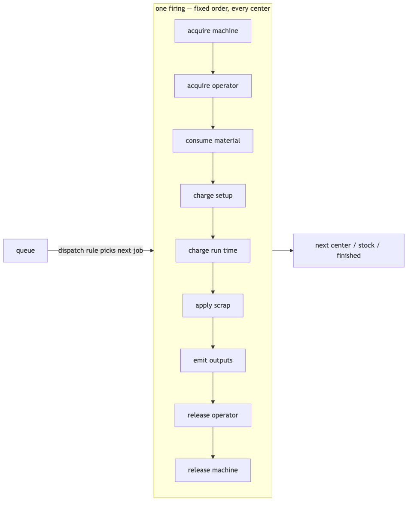
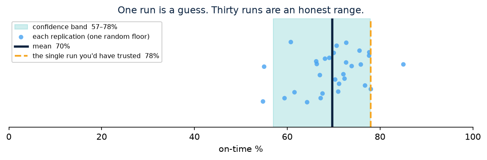

# Concepts — data & structure

What the twin is made of, so the config in [modeling.md](modeling.md) makes sense. You
never write simulation code; you declare *what the floor does* and the engine turns it
into mechanism. twinflow builds a working software copy of the floor on the left — the
glowing twin on the right — that you can run experiments on without touching the real one.

## The one idea

A floor is a set of **work centers** connected by a **routing**. Work flows through them
as **bundles**. Each center does one **operation** (a transform), competing for a
**machine** and an **operator**. That's the whole model; everything else is a knob on it.

## The vocabulary

| Thing | What it is |
|---|---|
| **Part type** | A declared material or product, with one unit of measure (`{name, uom}`). Everything that flows is a part type. |
| **Bundle** | The unit of flow: a quantity of one part type, in one uom, with attributes. Immutable — split/merge make new bundles. It's what sits in a queue. |
| **Stock** | A named material level you pull from (raw metal, wire, resin). Blocks work when empty; can refill itself (reorder point, lead time, a supplier). |
| **Location (work center)** | The floor node that runs one operation. It pulls a job from its queue, grabs a machine then an operator, consumes material, charges setup then run time, applies scrap, emits outputs, releases the operator then the machine — a fixed, auditable order every firing. |
| **Machine** | A server inside a center that remembers its own setup/changeover state. `capacity: N` = N machines in parallel. |
| **Labor pool** | A named, skilled group of operators, separate from machines. |
| **Transform** | The one contract every operation uses: input bundles → output bundles. Cutting, pouring, assembly, sorting, scrap — all the same mechanism, no special cases. |
| **Routing** | The ordered list of centers a part visits (`{part, steps}`). |
| **Bill of materials** | Rolled up automatically from what each operation consumes. You never hand-write it. |

## How work flows (one firing)

The order is fixed and the same at every center, which is what makes a run auditable and
reproducible. A **dispatch rule** (active control) decides *which* queued job is pulled;
the default is arrival order.

## The plan

A production plan (`.xlsx`/`.csv`) is a table of **work orders**: what part, how many, when
released (`start_date`), when due (`due_date`), optional rush `priority`, and optional
initial WIP already on the floor. One `model.yaml` + one plan is a complete client — no
per-plant code. See [modeling.md](modeling.md#the-plan).

## What a run produces

`twinflow run` writes a folder under `runs/<run-id>/`:

| File | What it holds |
|---|---|
| `report.html` | A self-contained, offline report: headline KPIs with confidence bands, a value-stream diagram, range charts, and the assumptions the engine had to make. |
| `kpis.json` | Every KPI as machine-readable JSON (a versioned contract). |
| `intervals.json` | The confidence bands across replications. |
| `run_meta.json` | The reproducibility stamp: hashes of model + plan, the seed, engine/Python versions, dependency set. |
| `events.parquet` | The single event log every KPI is computed from — one row per firing. |
| `inventory.parquet` | Stock levels over time (for supply-chain KPIs). |

Every KPI comes from that one event log — there is no second source of truth.

## The KPIs

| KPI | Question it answers |
|---|---|
| Completion date + on-time %, per order | Will these orders ship on time? |
| Utilization per cell / machine | Where does the line actually choke? |
| Wait breakdown (starved / blocked / material) | *Why* does it choke? |
| WIP over time | How much work is stuck on the floor? |
| Labor / machine / setup hours | Where does the time and money go? |
| Fill rate, on-time delivery, backorders | Orders & deliveries (see [adapters.md](adapters.md)). |
| Average inventory, stockout time, orders placed | Supply chain (see [modeling.md](modeling.md#supplier-lead-time--multi-echelon-inventory)). |

Run with `--reps > 1` and each KPI comes back as a **mean with a low-to-high confidence
band**, not a single fake-certain number.

Each dot is one replication of the same floor. The dashed line is the single run you might
have quoted a date from; the shaded band is the honest low-to-high range. twinflow reports
the band, not the dot.

## Reproducibility

Every stochastic source (cycle times, scrap, quality-gate routing, breakdowns, absence)
draws from its **own seeded stream**, keyed only on `(seed, replication_index, source)`.
So: the same inputs give the same answer forever, and when you compare two setups they run
on the *same* random draws (common random numbers), making the comparison fair instead of
noisy. The run stamp lets any result be traced back and re-created exactly.

## The architecture (for the curious)

Five layers; lower layers never import higher ones, and layers 0–2 never change per client
— only config does.

| Layer | Package | Owns |
|---|---|---|
| 0 Engine | `twinflow.engine` | The clock, deadlock-safe acquisition, per-source RNG |
| 1 Primitives | `twinflow.primitives` | Bundle, Stock, Location, Machine, Transform, TimeModel, LaborPool |
| 2 Model | `twinflow.model` | `model.yaml` → validated routing graph + BOM (the only config trust boundary) |
| 3 Plan | `twinflow.plan` | Work orders, release, the run driver, replications |
| 4 Instrumentation / Report | `twinflow.instrumentation`, `twinflow.report` | Event log → KPIs → the HTML/JSON report |
| 5 Modules / Adapters / Service | `twinflow.modules`, `twinflow.adapters`, `twinflow.service` | Optimization surface, integration seams, the REST API |

A new capability is added to the engine for everyone as compiled config, never as
per-client code.
