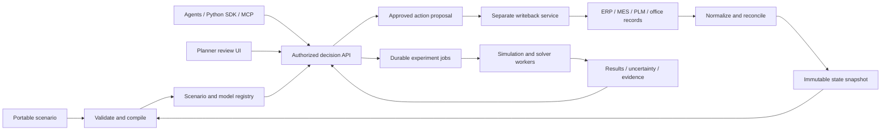

# Twinflow: roadmap to an enterprise decision twin

Prepared 2026-09-12. Repository reviewed at `af5500d`.

Companion: [Implementation playbook](enterprise-build-playbook.md). Every `RM-NN` below has a matching implementation section with architecture, tools, code sketches, and acceptance tests. This is a proposed product direction, not an implementation-complete specification.

## Recommendation

Build **the operational decision engine that agents use to understand an operation, test changes, and produce defensible recommendations**. A portable file should describe the operation, its current state, and the decision being evaluated. A person or agent should be able to load it, ask what is feasible, compare alternatives, and retrieve dates, costs, risks, assumptions, and evidence.

Your strongest starting market is **high-mix, low-volume manufacturing**, especially a supplier whose engineering approvals, purchasing, outside processing, and shop scheduling all affect delivery. Start with one repeatable question: **“Can we accept this order, what date can we reasonably promise, and what change would improve that date?”** That naturally expands from the shop into its front office and supply network.

Supply-chain scope is deliberately broad: aerospace is one stress-test example for regulation, multiple tiers, multi-process parts, assembly, BOMs, quality, compliance, and paperwork. These are reusable capabilities, not an aerospace-only product.

Manufacturing, front-office, and supply-network scenarios must also work independently. A front-office case does not need a factory, and a distribution network does not need manufacturing nodes. HMLV is the recommended initial commercial focus because it matches the existing code; it does not define the limits of the platform.

The code already supports meaningful simulation experiments. It does not yet establish the operational fidelity, prediction validity, or service reliability required for enterprise decisions. Preserve the simulation core and its declarative model; invest first in semantics, evidence, and agent contracts.

The defensible product advantage will be the combination of a portable scenario standard, validated domain behavior, quick onboarding, and a record of predictions compared with actual outcomes. A chat interface or another optimizer alone will be easier to reproduce.

## What the target experience looks like

1. A planner loads `supplier-network.twin.yaml`, or an agent imports it through the SDK. A complete small scenario needs one file and no network connection.
2. Twinflow validates units, calendars, routes, state, and constraints. It shows what came from records, what someone estimated, and which questions the model can support.
3. The planner sees one connected process: quote → engineering → material availability → machining → outside treatment → inspection → shipment. Each stage has its own resources and rules.
4. An agent asks for delivery forecasts for an additional order, branches the baseline, and tries overtime, a qualified alternate machine, a different release policy, and an approved supplier.
5. Twinflow returns feasible alternatives, delivery quantiles and on-time probabilities, incremental cost, the impact on existing commitments, binding constraints, and an evidence reference.
6. The planner approves a specific recommendation. A separately authorized integration checks that the operational state is still current before writing anything back.
7. Actual events update the next snapshot and reveal whether the prediction was accurate. Model versions earn, retain, or lose approval for specific decision types.

The file is the portable definition and snapshot. The enterprise service stores evolving versions and events. **Single-file onboarding does not require putting an enterprise’s complete event history or credentials into one YAML document.**

## Where the project stands

Evidence comes from the source and existing tests, not just README claims. `.venv/bin/pytest -q` completed with **507 passed, one dependency deprecation warning, in 31.66 seconds** on this machine. This review did not rerun the entire CI toolchain, benchmark enterprise workloads, or validate against customer data.

| Area | What exists | Gap and consequence | Repository evidence |
|---|---|---|---|
| Core engine | SimPy execution; immutable bundles; stocks; batching; routing; setup; disruptions | Strong foundation, but realistic constraints require further domain work | [Driver](../src/twinflow/plan/driver.py), [location](../src/twinflow/primitives/location.py) |
| Portable onboarding | Model YAML plus CSV/XLSX plan; multiple runnable examples | Two inputs; no complete portable scenario schema, migrations, or import workflow | [Plan loader](../src/twinflow/plan/loader.py), [catalog](../src/twinflow/service/app.py) |
| Calendars and dates | Shift interface and simulation time | Driver constructs always-on calendars; calendar dates need explicit epoch, timezone, working-time semantics | `_AlwaysOnShiftCalendar` in [driver](../src/twinflow/plan/driver.py) |
| Resources | Capacity-N and labor pools | Parallel firings share `spec.machine.current_setup`; KPI attribution uses location/default pool rather than actual assigned identities | [Location](../src/twinflow/primitives/location.py), [KPIs](../src/twinflow/instrumentation/kpis.py) |
| Completion and service | Order completion, lateness, fulfillment helpers | Completion is max recorded lot release time, not a terminal accepted-quantity ledger; orders without events are excluded from on-time denominator | `KpiEngine._order_kpis` in [KPIs](../src/twinflow/instrumentation/kpis.py) |
| Uncertainty | Replications, seeded source streams, mean-CI and paired-difference helpers | UI-facing aggregation uses percentiles but calls them confidence intervals; missing completions are filtered out | [Aggregation](../src/twinflow/instrumentation/aggregate.py), [replication](../src/twinflow/plan/replication.py) |
| Optimization | Shared scoring surface and pluggable optimizers/objectives | Several objectives, inventory metrics, and costs consume the first replication; no general schedule-feasibility contract | [Surface](../src/twinflow/modules/surface.py), [objectives](../src/twinflow/modules/objectives.py) |
| Reproducibility | `RunStamp`, hashes, seeds, artifact generation | Hashes alone cannot reconstruct deleted inputs; all execution paths need consistent retained evidence and pinned environments | [Run stamp](../src/twinflow/run_stamp.py), [surface](../src/twinflow/modules/surface.py) |
| Agent interface | Python API, REST jobs, lever discovery, Gym-style wrapper | No MCP service or durable scenario registry; `TwinEnv.step()` re-scores lever settings rather than advancing a live operational state | [RL adapter](../src/twinflow/adapters/rl.py), [service](../src/twinflow/service/app.py) |
| Data and validation | CSV mapping, Parquet actuals, reconciliation, KPI-fitting calibration | Adapter seams are not production ERP/MES connectors; calibration fit is not held-out predictive validation | [Connectors](../src/twinflow/adapters/connectors.py), [calibration](../src/twinflow/modules/calibrate.py) |
| Front office | General flow primitives could be reused | No first-class case lifecycle, approval identity, business SLA clocks, or information-artifact dependencies found | [Schema](../src/twinflow/model/schema.py), [examples](../examples/) |
| Supply chain | Finite stock, reorder policies, lead times, upstream stock chains | Needs purchase lines, allocations, supplier capacity/qualification, lot genealogy, correlated disruptions, and cross-site calendars | [Supply-chain guide](supply-chain.md) |
| Enterprise service | FastAPI, React, background jobs, local files | In-memory job state; no application tenant/auth boundary; global `os.chdir` inside threaded work creates a concurrency hazard | [Jobs](../src/twinflow/service/jobs.py), `_scratch_cwd` in [surface](../src/twinflow/modules/surface.py) |

Additional metric debt: `material_starved` is currently hardcoded to zero in the KPI wait breakdown; utilization is accumulated busy time divided by horizon without a full capacity/calendar denominator; reconciliation converts missing completion/lateness to zero. These details can mislead an agent even when the simulator executes correctly.

**Assessment:** a capable local simulation alpha with useful extension seams. It is ready to develop with design partners. Enterprise forecasting, broad domain coverage, and unattended operational use remain to be demonstrated.

## Product and architecture commitments

- **One simulation kernel; explicit domain semantics.** Share time, queues, resources, events, experiments, and evidence. Manufacturing consumes material; an approval checks an information artifact and authorization. Do not model those as identical physical transformations merely to reuse a class.
- **Three separate objects:** a model definition, an immutable operational snapshot, and an experiment containing changes, objectives, constraints, and run settings. A scenario capsule packages them together.
- **Agents propose; deterministic services validate and evaluate.** Natural language may create drafts. Hard constraints and KPI calculations execute in code. Explanations refer to event evidence and interventions run in the model.
- **Fidelity is decision-specific.** A model approved for staffing experiments may remain unsuitable for customer promise dates. Track permitted uses, calibration history, omitted constraints, and data freshness.
- **Expose facts, forecasts, and commitments distinctly.** A P90 completion date is a simulated quantile conditional on a model and snapshot. An approved customer commitment is a business action with an owner.
- **Keep a modular Python application with separate compute workers.** Add infrastructure when a measured requirement needs it; retain a local/offline mode. Use the existing React UI as the human review surface.
- **A normal customer is configuration and mapping.** Reusable domain capabilities belong in maintained packages; system-specific connectors can require code. Avoid promising every enterprise deployment will need no engineering.

## Sequence and investment

The following effort ranges are planning estimates, not delivery promises. Assume a growing team of roughly 6–8 people: simulation/operations research, backend/data, platform/security, frontend/product, plus domain implementation support. Early stages can start with a smaller team. Access to usable customer history and expert review is a critical dependency.

| Step | Outcome | Indicative effort | Dependencies | Primary owner |
|---|---|---|---|---|
| [RM-01](#rm-01) | Correct answers and repeatable experiments | 3–5 weeks | None | Simulation lead |
| [RM-02](#rm-02) | One-file scenario and stable contracts | 4–6 weeks | RM-01 semantics | Backend + product |
| [RM-03](#rm-03) | HMLV dates and resource fidelity | 6–10 weeks | RM-01, RM-02 | Simulation + domain expert |
| [RM-04](#rm-04) | Agents can safely build and evaluate scenarios | 4–6 weeks | RM-01, RM-02; RM-03 for credible shop dates | Backend + agent integrations |
| [RM-05](#rm-05) | Snapshot synchronization and validated predictions | 8–12 weeks | RM-02, RM-03; basic platform controls | Data + simulation |
| [RM-06](#rm-06) | Feasible schedules and robust recommendations | 6–10 weeks | RM-03–RM-05 | Operations research |
| [RM-07](#rm-07) | Front-office and information-flow twin | 6–10 weeks | RM-02, RM-04, RM-05 | Domain modeling + product |
| [RM-08](#rm-08) | Complex supply-network decisions | 10–16 weeks | RM-03, RM-05, RM-06; RM-07 for office handoffs | Supply-chain + data |
| [RM-09](#rm-09) | Enterprise deployment and procurement readiness | 8–12 weeks of hardening, ongoing controls | Begins at RM-04; paid remote pilots need its minimum controls | Platform/security + product |
| [RM-10](#rm-10) | Proven scale and bounded operational action | 12–20 weeks plus outcome observation | RM-05, RM-06, RM-09; domain gates where used | Platform + operations research + customer success |

These tracks can overlap once contracts stabilize. Budget approximately **12–18 months for a focused enterprise product and 18–24+ months for validated breadth across all three domains** under these staffing assumptions. A small founder team should narrow scope and extend the schedule. A single successful shop deployment is a more valuable milestone than nominal support for every industry.

## RM-01 — Establish trustworthy results

**Deliver:** a corrected decision-result contract, complete order accounting, bounded simulation execution, truthful statistics, and concurrency-safe artifacts. Preserve the current passing tests and add independent analytical and failure cases. Align README/UI claims with behavior.

Highest priority: verified terminal quantity; incomplete orders and horizon censoring; resource and labor attribution; quantiles versus confidence intervals; replicated objective scoring; paired comparisons; explicit output paths. Retain inputs and execution environment references, not only hashes. Audit random-number pairing when dispatch order changes.

**Exit gate:** an unfinished or scrapped order cannot become a successful completion; all orders have explicit outcomes; concurrent experiments retain isolated artifacts; repeated pinned runs reproduce semantic results; statistics agree with known synthetic cases. No promising dates until RM-03 and RM-05 gates pass.

**Business proof:** planners can explain every headline metric from its evidence. [Build RM-01](enterprise-build-playbook.md#rm-01).

## RM-02 — Deliver the single-file promise

**Deliver:** versioned `.twin.yaml` containing model, snapshot, demand, calendars, experiment, assumptions, provenance, and declared capabilities. Existing model-plus-plan inputs remain importable. Provide validation, deterministic migrations, export, diff, and a short human review.

Ship a complete small HMLV example first. Reserve and validate extension points for office and network profiles; advertise those as runnable only when their domain gates pass. For larger datasets, later support a `.twin` archive containing the same manifest plus embedded columnar tables. Distinguish a self-contained portable export from a manifest that needs external data.

**Exit gate:** a new user loads a provided capsule and gets a baseline result within five minutes on documented reference hardware; local execution needs no credentials; round-trip export preserves semantics and provenance; unknown required capabilities fail clearly. A customer export still requires mapping and validation—five minutes is not a claim about modeling a new plant from raw records.

**Business proof:** time to first experiment falls without hiding uncertainty. [Build RM-02](enterprise-build-playbook.md#rm-02).

## RM-03 — Make HMLV decisions operationally credible

**Deliver:** working calendars and timezones, real machine identities, operator skills/qualification, independent setups, alternate resources/routes, multiple material reservations, fixtures/tools, WIP remaining work, split/merge genealogy, bounded rework, and outside processing. Implement in that priority order against a reference shop.

Date outputs must include earliest feasible estimates, P50/P80/P90 completion where estimable, on-time probability, frozen commitments, and displaced orders. Separate unattended machine time from operator load/unload and attended work. Explicitly represent when a material or document gate prevents release.

**Exit gate:** deterministic cases match hand-calculated schedules across shifts, resource contention, and material shortages. Domain experts accept the model representation of two materially different HMLV shops. Statistical accuracy remains gated by RM-05.

**Business proof:** answer the rush-order question while respecting existing customer commitments. [Build RM-03](enterprise-build-playbook.md#rm-03).

## RM-04 — Make agents first-class users

**Deliver:** typed Python SDK, versioned REST contract, MCP adapter, immutable scenario branching, semantic edits, capability discovery, asynchronous evaluation/compare/optimize jobs, cancellation, budgets, and machine-readable evidence. These transports call the same application functions.

An agent should discover allowed levers and units, branch a snapshot, validate a proposal, submit a bounded experiment, compare with baseline, and explain the result. All calls carry server-established identity and scope. Large logs are retrieved by authorized artifact queries; the normal response is compact.

**Exit gate:** two independent agent clients complete a benchmark task suite without private imports or direct filesystem access. Tests cover invalid edits, stale versions, excess budgets, embedded malicious instructions, and unauthorized artifact access. No agent framework is required to use the engine.

**Business proof:** other teams can build useful decision agents without learning Twinflow internals. [Build RM-04](enterprise-build-playbook.md#rm-04).

## RM-05 — Connect reality and validate prediction quality

**Deliver:** one production-quality read-only ERP/MES integration for a design partner, normalized event ingestion, immutable as-of snapshots, reconciliation, freshness rules, and model validation reports. Add parameter provenance, hierarchical estimates for sparse HMLV families, holdout backtests, and drift monitoring.

Evaluate against historical snapshots using only information available at each decision time. Compare with the current planner method, ERP dates, and simple dispatch baselines. Fit processing and waiting mechanisms separately; a low aggregate calibration error can hide the wrong bottleneck.

**Exit gate:** on a preregistered holdout, improve the selected date-error metric over the incumbent, publish interval coverage and sample counts by relevant segment, and meet customer-agreed tolerances. Example pilot targets: 15% lower median absolute date error and 80–95% empirical coverage for a nominal P90 upper date on a sufficiently sized cohort; tune targets before examining the holdout. Sparse segments remain provisional. Stale or incomplete data blocks unsupported recommendations.

**Business proof:** users can see whether the twin deserves trust for a particular decision. [Build RM-05](enterprise-build-playbook.md#rm-05).

## RM-06 — Optimize feasible decisions

**Deliver:** a scheduling solver for hard feasibility and candidate generation, followed by stochastic simulation for risk evaluation. Add capacity-to-promise, frozen windows, weighted business objectives, Pareto alternatives, sensitivity analysis, and intervention-based bottleneck explanations.

Start with overtime, sequencing, release rules, alternate qualified machines, and buffer settings. Evaluate the business outcome across replications and independent validation seeds. Penalize schedule churn and report disruption to existing work. Show “best found within budget” unless an optimization bound actually supports a stronger claim.

**Exit gate:** no accepted recommendation violates a hard constraint; independent checks confirm schedules; candidates outperform dispatch baselines on held-out scenarios and do not depend on lucky seeds. An infeasible request returns named conflicts, not an invented date.

**Business proof:** a planner can justify the incremental benefit and cost of a recommendation. [Build RM-06](enterprise-build-playbook.md#rm-06).

## RM-07 — Add front-office information flow

**Deliver:** a domain pack for cases, tasks, document revisions, approvals, roles, service calendars, queue aging, parallel joins, rework, escalations, and external response delays. Make quote-to-release the first end-to-end office process.

Then demonstrate a standalone information process such as purchase approval, invoice resolution, or customer onboarding using the same case primitives, without material stocks or machines.

Information can be shared without being consumed. An approved drawing revision, purchase approval, or customer response can gate physical work. Attribute case delays to active work, internal queue, missing information, and external waiting. Preserve links between a case and multiple orders, documents, and suppliers.

**Exit gate:** simulate a branched approval flow with rework and separation of approval roles; reconcile it to case history; show the downstream ship-date impact of reducing an office queue. Pass profile-specific holdout validation.

**Business proof:** the product can find delays before work reaches the floor. [Build RM-07](enterprise-build-playbook.md#rm-07).

## RM-08 — Model complex supply networks across industries

**Deliver:** explicit supplier/site/process nodes, purchase-order lines, shipments, allocation and pegging, parts/components/assemblies, multi-level BOM revisions/effectivity, lot/serial genealogy, approved sources and processes, inspection holds, expiry, substitutions, transport calendars, and capacity-dependent lead times. Quality, required paperwork, regulatory obligations, and customer-specific compliance are configurable rules with evidence and validity periods.

Model shared sub-tier exposure and correlated disruptions. Represent uncertain supplier information as uncertain; provide range-based answers when capacity is unknown. Link quality/document release to usable inventory and production availability. Start with one customer's critical material-to-delivery chain, then expand tiers. Supply-chain semantics are industry-neutral; profiles add requirements for aerospace, industrial equipment, electronics, food, medical products, or other sectors without hardcoding an industry into the kernel.

**Exit gate:** a multi-tier, multi-site reference network preserves quantity/genealogy, avoids double allocation, enforces qualification/effectivity, and traces a sub-tier disruption into affected orders and mitigation options. Validate forecast quality and information-sharing permissions with partners.

**Business proof:** recommendations respect material, process, quality, documentation, and compliance constraints instead of suggesting an unusable alternate supplier. [Build RM-08](enterprise-build-playbook.md#rm-08).

## RM-09 — Become deployable and purchasable by enterprises

**Deliver:** durable jobs and metadata, federated identity, tenant/project authorization, audit history, quotas, isolated workers, encryption/key integration, retention/deletion controls, backup/restore, observability, signed releases, supported upgrades, and deployment documentation.

Start minimum controls before any remotely hosted customer-data pilot: authenticated access, project isolation, durable evidence, restore procedure, and bounded compute. Later complete enterprise SSO, lifecycle provisioning, customer-managed deployment, security assessment, support runbooks, and contractual service levels. Product can begin with one isolated deployment per customer; shared tenancy is optional.

For customers with regulated, sensitive, or contractually restricted data, establish with the customer's responsible teams what data may be hosted where, who may access it, whether external model calls are permitted, and what contractual assessments are required. These are deployment acceptance inputs, not capabilities conferred by a technology choice. Track evidence and owners for the applicable requirements.

**Exit gate:** independent security review; cross-tenant denial tests; worker-crash/retry tests; restore and rollback drills; procurement evidence accepted by a real customer. Initial proposed service objectives: 99.9% monthly API availability, recovery within four hours, and at most 15 minutes of metadata loss, subject to measured infrastructure and contracted needs. Simulation runtime has a separate workload-dependent SLO.

**Business proof:** enterprise IT can operate, govern, and support the product. [Build RM-09](enterprise-build-playbook.md#rm-09).

## RM-10 — Prove scale and introduce bounded operational action

**Deliver:** measured workload tiers, cached/reused compilation, worker scheduling, incremental scenario evaluation where valid, decision-boundary observation/action, shadow deployments, approved writeback, and outcome tracking.

Introduce a true simulated observe → act → advance loop only after the offline decision API is stable. Policies need available-action masks, observable state, deterministic replay, and safe fallback. Research RL only where it improves on heuristics/solvers under independent validation. Scale replications and scenarios across workers before attempting distributed execution of one tightly coupled simulation.

Progression: read-only recommendation → human-approved schedule export → narrowly delegated actions within explicit limits. Each action checks current state, approved proposal identity, authorized scope, and expiration; record the downstream receipt and reconcile actual outcomes.

**Exit gate:** workload-tier performance and recovery targets are published with accuracy/fidelity settings; replay reproduces policy decisions; duplicate or stale writebacks cannot silently change operations; several paid customers renew after verified operational benefit. Expand beyond the initial domain only as domain-specific validation gates pass.

**Business proof:** agents improve real decisions repeatedly, at an acceptable compute and integration cost. [Build RM-10](enterprise-build-playbook.md#rm-10).

## First 90 days

| Window | Concrete work | Evidence at the end |
|---|---|---|
| Days 1–15 | Start RM-01; select 2–3 HMLV design partners; choose one promise-date decision; agree event and constraint definitions | Failing regression fixtures for identified gaps; signed-off decision definition and data inventory |
| Days 16–30 | Finish high-priority RM-01; implement capsule v0.1 and migrate existing examples; start real calendars | Corrected metrics; reproducible offline scenario import/export; baseline runtime measurements |
| Days 31–60 | RM-03 calendars/resource identity/WIP; RM-04 read-only agent workflow; first historical export mapping | One agent completes validate → branch → evaluate → compare with explicit assumptions |
| Days 61–90 | First read-only partner snapshot; initial RM-05 backtest; minimal RM-09 pilot controls; solve one useful scheduling case | Planner-reviewed forecast report and benefit baseline; a bounded paid-pilot scope |

This window targets a credible pilot, not all of RM-03–RM-06. If data access slips, continue engine fixtures and agent contracts but do not replace customer validation with synthetic success.

## How to judge “world class”

Track a small scorecard per customer and model version:

| Dimension | Measurement |
|---|---|
| Adoption | Time to first valid baseline; weekly active planners/agents; repeated decision workflows; pilot-to-paid conversion and renewal |
| Predictive validity | Date error versus incumbent; quantile coverage and width; on-time probability calibration; subgroup performance and drift |
| Operational benefit | Changes in on-time delivery, expedite spend, planner effort, and WIP; compare against agreed controls and record other operational changes |
| Agent usability | Valid task completion, repair attempts, rejected unsafe proposals, evidence retrieval success, cost per completed decision |
| Reliability | Job loss, duplicate actions, recovery outcomes, API availability, queue wait, cancellation response, tenant-isolation tests |
| Economics | Compute cost per decision, onboarding effort, connector maintenance, implementation margin, support burden |

Set thresholds with design partners before pilots. Publish failures and limitations along with wins. Three domain demonstrations are not equivalent to three validated domain products.

## Scope discipline

Defer photorealistic 3D, a custom agent framework, broad connector catalogs, a generalized ontology project, and RL training until they answer a demonstrated buying requirement. Keep floor/process visualization focused on queues, dependencies, changes, and evidence. Prefer the existing simulator plus targeted solver/data infrastructure over a rewrite.

Preserve the customer-facing promise: **bring an operation in one portable scenario; let people and agents test decisions against a model whose capabilities and limits are visible.**
