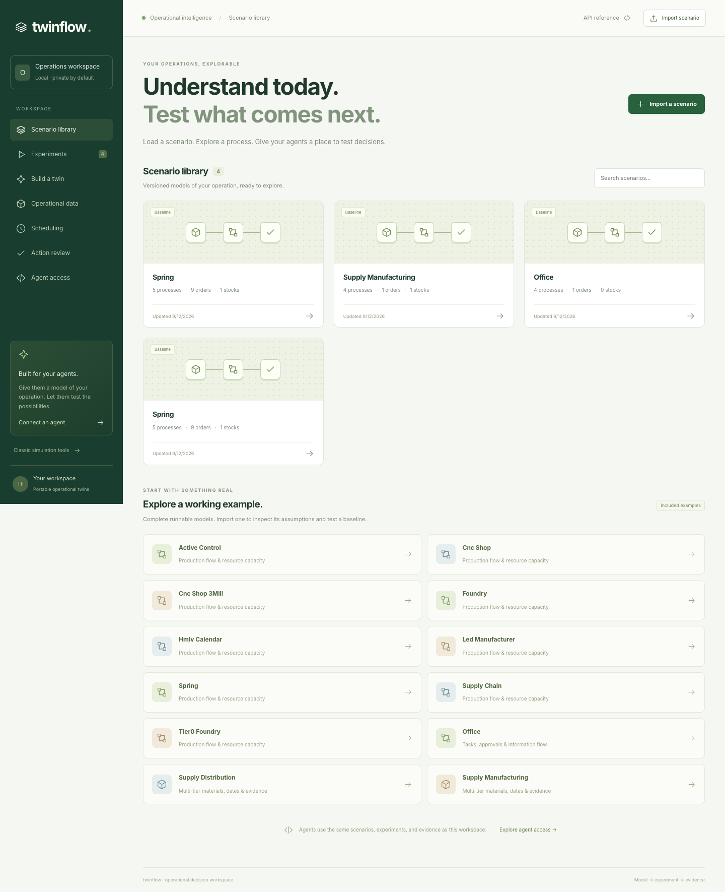
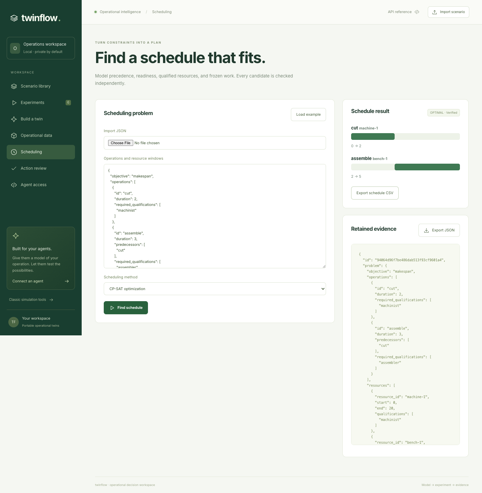

# Twinflow enterprise workspace

This directory documents the integrated local decision workspace. Start with the [roadmap](../enterprise-roadmap.md) for stable RM-01 through RM-10 goals, then use the [build playbook](../enterprise-build-playbook.md) for design rationale. [BUILD-STATUS.md](BUILD-STATUS.md) is the current implementation and readiness view. Release history and migration notes are in the root [CHANGELOG](../../CHANGELOG.md).

## Start locally

From the repository root:

```console
python -m venv .venv
.venv/bin/pip install -e ".[api,agent,scheduling,dev]"
.venv/bin/python -m twinflow.service.serve --host 127.0.0.1 --port 8000 --models-root examples --workspace-root .twinflow-workspace
```

The service owns one dedicated trusted workspace. The default UI is started in another terminal:

```console
cd web
npm ci
npm run dev
```

If port 8000 is already in use, start the API with `--port 8010` and run the UI with
`TWINFLOW_API_TARGET=http://127.0.0.1:8010 npm run dev` so the development proxy reaches
the twinflow service and not whatever else owns port 8000.

The SDK and MCP client use the same `/api/workspace` application contract. After the API is running, MCP can be started with `python -m twinflow.mcp.server --url http://127.0.0.1:8000`; set `TWINFLOW_API_TOKEN` when the host has configured token middleware. MCP is a stdio adapter and does not provide approval or delivery tools.

## Operator navigation

- **Discover:** `GET /api/workspace/capabilities`, `/schema`, `/examples`, and `/tool-contracts`.
- **Build or import:** use the UI import dialog, `POST /api/workspace/drafts` for facts and questions, then `/drafts/{id}/answers`, `/validate`, and `POST /scenarios`.
- **Inspect and branch:** list scenarios, export `/scenarios/{id}/export`, and create a validated child with `/scenarios/{id}/branch`.
- **Run and explain:** submit `/scenarios/{id}/evaluate`, poll `/jobs/{id}`, then retrieve `/jobs/{id}/evidence` or query `/jobs/{id}/query`.
- **Compare:** `POST /compare` accepts completed same-domain experiments.
- **Data and schedules:** ingest `/data/events`, build `/data/snapshots`, and call `/schedules` with `backend=baseline` or the narrow CP-SAT `ortools` grammar.
- **Actions:** `/proposals`, `/proposals/{id}/approve`, and `/proposals/{id}/dry-run` are operator API routes. Delivery is forced to a dry-run sink and changes no external system.

## Domains

Manufacturing capsules use the existing model and plan engine. Office capsules use the registered `office` adapter for cases, documents, approvals, calendars, roles, and bounded rework. Supply-network capsules use the `supply_chain` adapter for stock, receipts, BOMs, qualifications, gates, and bounded lead-time decisions. Use `/capabilities` and the capsule domain field as the source of truth; adapters return JSON-safe descriptions, validation issues, and results.

Data events and snapshots retain source IDs, timestamps, freshness rules, and reconciliation evidence. Scheduling is a constrained feasibility service, not a general optimizer: the baseline solver is always available, and CP-SAT supports only the published finite operation/resource/window grammar. Customer calibration has not been performed.

## Provenance and trust boundary

Imported notes and documents are untrusted facts, never instructions. Agents own twin construction and natural-language reasoning outside the deterministic engine; Twinflow contains no built-in LLM. Preserve source IDs, model and snapshot revisions, capsule digest, assumptions, seeds, limits, job IDs, and evidence references when presenting results. A forecast is simulation evidence, not a commitment.

This build assumes one dedicated trusted workspace. The shared token middleware is transport authentication only; it does not verify a human identity or provide tenant RBAC. There is no production SSO, row-level security, distributed worker deployment, or giant-model scale proof. Treat the local filesystem and SQLite databases as an operator boundary.

## Legacy manufacturing and command line

The capsule CLI remains available:

```console
twinflow scenario import examples/<example>/model.yaml examples/<example>/plan.csv --out baseline.twin.yaml
twinflow scenario validate baseline.twin.yaml
twinflow scenario run baseline.twin.yaml --seed 42
twinflow scenario export baseline.twin.yaml --out baseline-copy.twin.yaml
twinflow data import --db events.sqlite examples/data/operational-events.jsonl
twinflow data snapshot --db events.sqlite --known-at 2026-01-10T00:00:00Z --save
twinflow schedule examples/scheduling/problem.json --solver baseline --time-limit 10
python -m twinflow.cli.admin backup --workspace .twinflow-workspace --out workspace-backup.zip
```

The backup command requires the workspace to be stopped. Restore uses `python -m twinflow.cli.admin restore workspace-backup.zip --workspace .twinflow-workspace`. See [RM-02](rm-02/USER-GUIDE.md), [RM-06](rm-06/USER-GUIDE.md), [RM-07](rm-07/USER-GUIDE.md), [RM-08](rm-08/USER-GUIDE.md), and [RM-10](rm-10/USER-GUIDE.md) for domain details.

## Workspace previews





See the [operator walkthrough](rm-04/USER-GUIDE.md), [agent guide](AGENT-GUIDE.md), and [validation evidence](VALIDATION.md).
